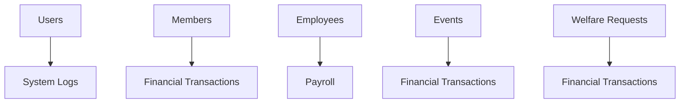

# TSOAM Church Management System - Technical Documentation

## 🏗️ System Architecture

### Overview

The TSOAM Church Management System is a modern, full-stack web application built with a React frontend and Node.js backend, designed specifically for church administration and management.

### Technology Stack

#### Frontend

- **Framework**: React 18.2+ with TypeScript
- **Build Tool**: Vite 4.5+
- **UI Library**: Radix UI + Tailwind CSS
- **State Management**: React Context + Hooks
- **Data Fetching**: TanStack Query
- **Routing**: React Router DOM 6
- **Charts**: Recharts
- **PDF Generation**: jsPDF + jsPDF-AutoTable
- **Excel Export**: XLSX

#### Backend

- **Runtime**: Node.js 16+
- **Framework**: Express.js
- **Database**: MySQL 8.0+
- **Authentication**: JWT + bcryptjs
- **File Upload**: Multer
- **Email**: Nodemailer
- **Documentation**: OpenAPI/Swagger

#### Database

- **Type**: Relational (MySQL)
- **Character Set**: UTF8MB4
- **Storage Engine**: InnoDB
- **Backup**: mysqldump

## 📁 Project Structure

```
tsoam-church-management-system/
│
├── client/                     # Frontend React application
│   ├── components/            # Reusable UI components
│   │   ├── auth/             # Authentication components
│   │   ├── layout/           # Layout components
│   │   └── ui/               # Base UI components
│   ├── contexts/             # React contexts
│   ├── hooks/                # Custom React hooks
│   ├── lib/                  # Utility libraries
│   ├── pages/                # Main application pages
│   ├── services/             # API service layer
│   ├── utils/                # Helper utilities
│   └── main.tsx              # Application entry point
│
├── server/                    # Backend Node.js application
│   ├── config/               # Configuration files
│   ├── routes/               # API route handlers
│   ├── uploads/              # File upload storage
│   └── server.js             # Server entry point
│
├── database/                  # Database files
│   ├── schema.sql            # Database schema
│   ├── init.sql              # Initial data
│   └── config.js             # Database configuration
│
├── scripts/                   # Build and utility scripts
├── docs/                      # Documentation files
└── README.md                  # Project overview
```

## 🔐 Security Architecture

### Authentication & Authorization

#### JWT Authentication

- Stateless authentication using JSON Web Tokens
- Token expiration: 24 hours (configurable)
- Refresh token mechanism for extended sessions
- Secure HTTP-only cookies for token storage

#### Role-Based Access Control (RBAC)

```typescript
interface UserRoles {
  Admin: {
    permissions: ["*"]; // Full system access
  };
  "HR Officer": {
    permissions: ["members", "hr", "appointments", "system-logs"];
  };
  "Finance Officer": {
    permissions: ["finance", "welfare", "events"];
  };
  User: {
    permissions: ["members", "events", "messaging", "settings"];
  };
}
```

#### Security Features

- Password hashing with bcrypt (12 rounds)
- SQL injection prevention with parameterized queries
- XSS protection with input sanitization
- CORS configuration for frontend/backend communication
- File upload restrictions and validation
- Rate limiting on API endpoints

### Data Protection

#### Database Security

- Encrypted connections (SSL/TLS)
- Principle of least privilege for database users
- Regular security audits and updates
- Automated backup encryption

#### File Security

- File type validation
- Size limitations (10MB per file)
- Secure file storage outside web root
- Virus scanning integration (optional)

## 📊 Database Schema

### Core Tables

#### Users Management

```sql
-- System users with authentication
users (id, name, email, password_hash, role, permissions, created_at)

-- User access requests
user_requests (id, name, email, role, status, requested_by, created_at)
```

#### Member Management

```sql
-- Full church members
members (id, member_id, tithe_number, name, contact_info, membership_date)

-- New members in transition
new_members (id, visitor_id, name, contact_info, eligibility_status)
```

#### Financial Management

```sql
-- All financial transactions
transactions (id, type, category, amount, date, status, module)

-- Expense tracking
expenses (id, category, amount, supplier, date, status)

-- Investment tracking
investments (id, type, amount, roi, status)
```

#### HR Management

```sql
-- Employee records
employees (id, employee_id, name, position, salary, status)

-- Payroll processing
payroll (id, employee_id, period, gross_salary, deductions, net_salary)

-- Leave management
leave_requests (id, employee_id, type, dates, status)
```

### Data Relationships



## 🔄 Business Logic

### Financial Integration System

The system implements a centralized financial architecture where all monetary transactions from different modules flow through the Finance module:

#### Transaction Flow

1. **Source Modules**: HR, Inventory, Welfare, Events
2. **Central Hub**: Finance Module
3. **Approval Workflow**: Transactions > KSh 1,000 require approval
4. **Real-time Sync**: Immediate updates across all modules

#### Key Services

```typescript
// Financial Transaction Service
class FinancialTransactionService {
  // Central transaction management
  addTransaction(transaction): FinancialTransaction;

  // Module-specific integrations
  addPayrollExpense(payrollData): FinancialTransaction;
  addInventoryPurchase(inventoryData): FinancialTransaction;
  addWelfarePayment(welfareData): FinancialTransaction;
  addEventExpense(eventData): FinancialTransaction;

  // Approval workflow
  getPendingTransactions(): FinancialTransaction[];
  approveTransaction(id, approver): boolean;
  rejectTransaction(id, approver, reason): boolean;
}
```

### Member Lifecycle Management

#### New Member Process

1. **Registration**: Visitor registers as new member
2. **Requirements**: Baptism + Bible study completion
3. **Waiting Period**: Minimum 6 months
4. **Eligibility Check**: Automated system verification
5. **Transfer**: Manual approval to full membership

#### Member Status Tracking

- **Active**: Regular attendance and participation
- **Inactive**: Reduced activity
- **Suspended**: Temporary restriction
- **Excommunicated**: Removed from membership

### Inventory Management

#### Asset Tracking

- **Categories**: Equipment, Furniture, Vehicles, etc.
- **Status Tracking**: Working, Faulty, Under Maintenance
- **Maintenance Scheduling**: Routine and repair tracking
- **Financial Integration**: Purchase and maintenance costs

### Welfare System

#### Request Processing

1. **Application**: Member submits welfare request
2. **Verification**: Check membership and financial status
3. **Assessment**: Review need and church resources
4. **Approval**: Committee decision
5. **Payment**: Financial integration for tracking

## 🔌 API Architecture

### RESTful API Design

#### Base URL Structure

```
/api/v1/{module}/{resource}
```

#### Authentication

```http
Authorization: Bearer {jwt_token}
Content-Type: application/json
```

#### Common Endpoints

```javascript
// Authentication
POST /api/auth/login
POST /api/auth/logout
POST /api/auth/refresh

// Members
GET /api/members
POST /api/members
PUT /api/members/:id
DELETE /api/members/:id

// Financial
GET /api/finance/transactions
POST /api/finance/transactions
GET /api/finance/summary

// HR
GET /api/hr/employees
POST /api/hr/payroll
GET /api/hr/leave-requests
```

### Error Handling

#### Standard Error Response

```json
{
  "success": false,
  "error": {
    "code": "VALIDATION_ERROR",
    "message": "Invalid input data",
    "details": [
      {
        "field": "email",
        "message": "Invalid email format"
      }
    ]
  },
  "timestamp": "2024-01-15T10:30:00Z"
}
```

#### HTTP Status Codes

- `200`: Success
- `201`: Created
- `400`: Bad Request
- `401`: Unauthorized
- `403`: Forbidden
- `404`: Not Found
- `422`: Unprocessable Entity
- `500`: Internal Server Error

## 🎨 Frontend Architecture

### Component Structure

#### Layout System

```tsx
<Layout>
  <Header />
  <Sidebar />
  <MainContent>
    <PageComponent />
  </MainContent>
  <Footer />
</Layout>
```

#### State Management

- **Global State**: Authentication, Theme, Notifications
- **Local State**: Form data, UI interactions
- **Server State**: API data with TanStack Query
- **Persistent State**: localStorage for preferences

#### Routing Protection

```tsx
<ProtectedRoute allowedRoles={["Admin", "HR Officer"]}>
  <HRDashboard />
</ProtectedRoute>
```

### UI/UX Patterns

#### Design System

- **Color Palette**: Professional blue/gray theme
- **Typography**: Inter font family
- **Spacing**: 4px base grid system
- **Components**: Consistent Radix UI components

#### Responsive Design

- **Mobile First**: 320px+ breakpoint
- **Tablet**: 768px+ breakpoint
- **Desktop**: 1024px+ breakpoint
- **Large Desktop**: 1440px+ breakpoint

## 🔧 Development Guidelines

### Code Quality

#### TypeScript Standards

- Strict mode enabled
- Interface definitions for all data structures
- Proper type annotations
- Generic types where appropriate

#### Code Organization

- **Services**: Business logic abstraction
- **Hooks**: Reusable state logic
- **Utils**: Pure helper functions
- **Components**: UI component library

### Testing Strategy

#### Unit Testing

- Component testing with React Testing Library
- Service testing with Jest
- Database query testing

#### Integration Testing

- API endpoint testing
- Authentication flow testing
- Database integration testing

#### End-to-End Testing

- User workflow testing
- Cross-browser compatibility
- Performance testing

### Performance Optimization

#### Frontend

- Code splitting with React.lazy
- Image optimization
- Bundle size monitoring
- Caching strategies

#### Backend

- Database query optimization
- Connection pooling
- Response compression
- Rate limiting

## 📈 Monitoring & Analytics

### System Health

#### Key Metrics

- **Response Time**: API endpoint performance
- **Error Rate**: Failed requests percentage
- **Database Performance**: Query execution time
- **User Activity**: Login sessions and features used

#### Logging

- **Application Logs**: Business logic events
- **Error Logs**: Exception tracking
- **Access Logs**: HTTP request logging
- **Security Logs**: Authentication attempts

### Business Intelligence

#### Dashboard Analytics

- Member growth trends
- Financial summaries
- Attendance patterns
- System usage metrics

#### Reporting

- Automated monthly reports
- Custom report generation
- Data export capabilities
- Visual analytics charts

## 🚀 Deployment & Scaling

### Environment Configuration

#### Development

- Hot reload enabled
- Debug logging
- Mock data services
- Local database

#### Staging

- Production-like environment
- Integration testing
- Performance profiling
- Security scanning

#### Production

- Optimized builds
- Error monitoring
- Auto-scaling policies
- Backup strategies

### Scaling Considerations

#### Horizontal Scaling

- Load balancer configuration
- Database clustering
- CDN for static assets
- Session management

#### Vertical Scaling

- CPU optimization
- Memory management
- Database tuning
- Cache optimization

## 🔄 Maintenance & Updates

### Regular Maintenance

#### Weekly

- Security patch updates
- Database backup verification
- Performance monitoring review
- User feedback collection

#### Monthly

- Dependency updates
- Security audit
- Performance optimization
- Feature usage analysis

#### Quarterly

- Major version updates
- Infrastructure review
- Capacity planning
- Disaster recovery testing

### Update Process

#### Development Workflow

1. Feature development in branches
2. Code review and testing
3. Staging deployment
4. User acceptance testing
5. Production deployment

#### Rollback Strategy

- Database migration rollback
- Application version rollback
- Configuration rollback
- Emergency procedures

---

**Document Version**: 2.0.0  
**Last Updated**: January 2024  
**Author**: TSOAM Development Team
